# Azure OpenAI Integration Setup

### Azure OpenAI Integration Setup

1. **Navigate** to your [Microsoft Azure Portal](https://portal.azure.com).
2. **Click** the ➕ button to Create a Resource.

<figure><figcaption></figcaption></figure>

3. **Search** for _Azure OpenAI_.
4. **Choose** _Azure OpenAI_.

<figure>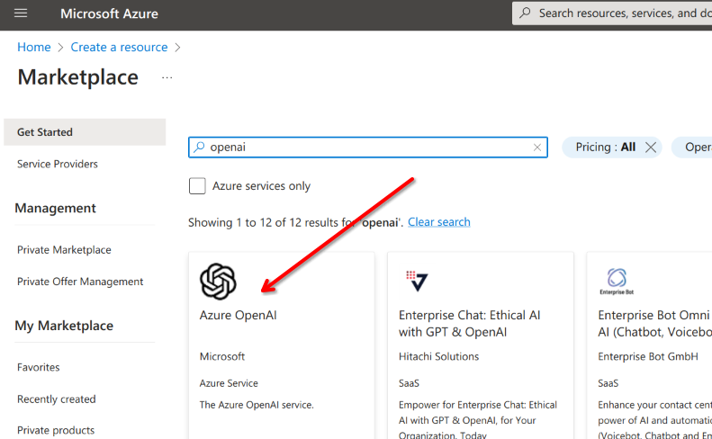<figcaption></figcaption></figure>

5. **Request** access to the Azure OpenAI service.


You must fill out a form to request access to the Azure OpenAI service


<figure>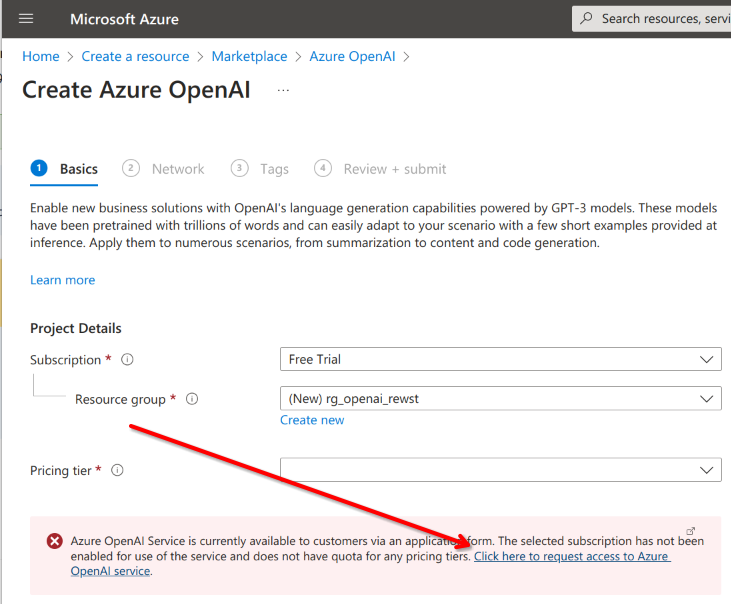<figcaption></figcaption></figure>

6. **Wait** for the Welcome Email.


Note that activation of the service can take up to 48 hours, based on Microsoft's timelines (so who knows, somewhere between 3 minutes and 7 days maybe?)


<figure>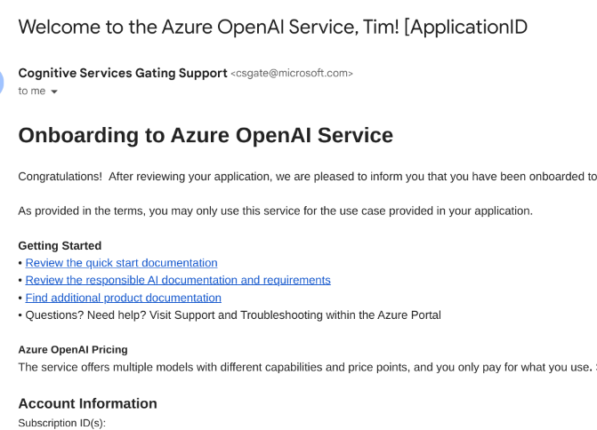<figcaption></figcaption></figure>

7. **Return** to the Azure Portal upon receiving the approval email.
8. **Create** the OpenAI Service in your Azure subscription.

<figure>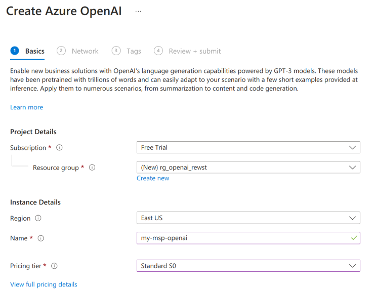<figcaption></figcaption></figure>

9. **Navigate** to _Model deployments_.

<figure>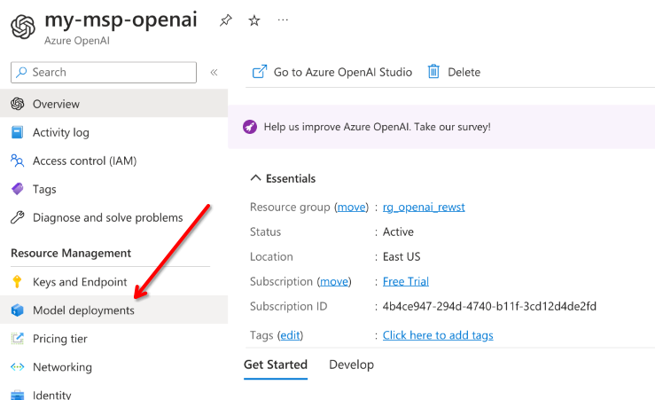<figcaption></figcaption></figure>

10. **Create** a new Deployment.

<figure>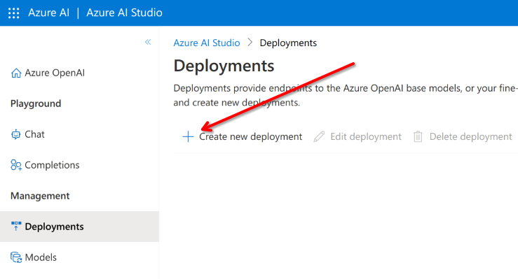<figcaption></figcaption></figure>

11. **Choose** _gpt-35-turbo model_.
12. **Name** the deployment the same. This will keep things easier to remember.

<figure>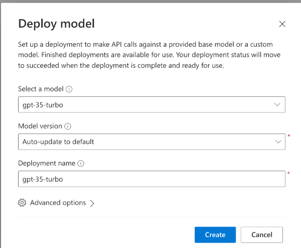<figcaption></figcaption></figure>

13. **Return** to the OpenAI Resource in the Azure Portal.
14. **Navigate** to _Keys and Endpoint_.
15. **Copy** a Key to your clipboard.

<figure>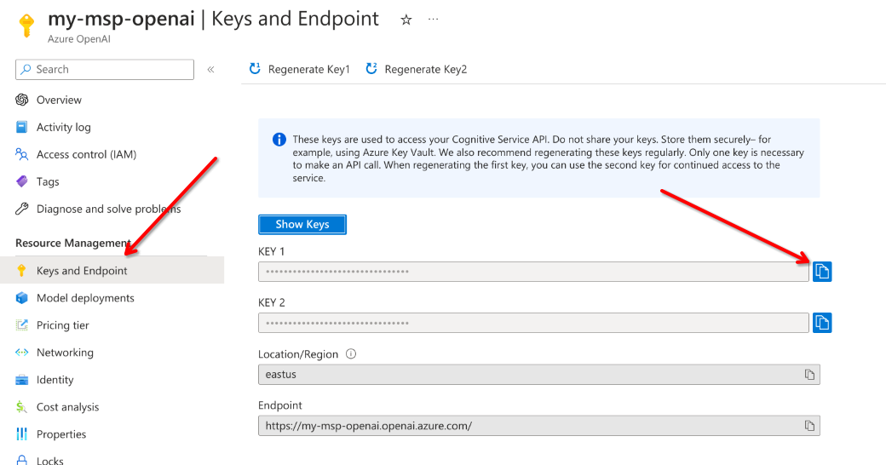<figcaption></figcaption></figure>

16. **Return** to Rewst.
17. **Navigate** to _Integrations_.
18. **Choose** OpenAI.

### Configuring Azure OpenAI with Existing OpenAI Integrations

If you already have an OpenAI integration configured, you can add an instance for Azure.

1. **Click** the drop-down → _Add Configuration_.

<figure>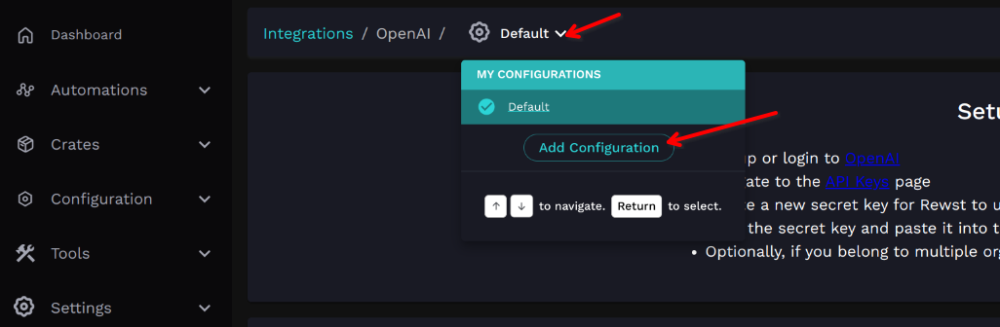<figcaption></figcaption></figure>

2. **Name** the configuration (example: "Azure" ).
3. **Copy** the Base URL from the "_Keys and Endpoint_" page in Azure and the Deployment Name, as shown below.
4. **Add** the _Azure API Version_.

<figure>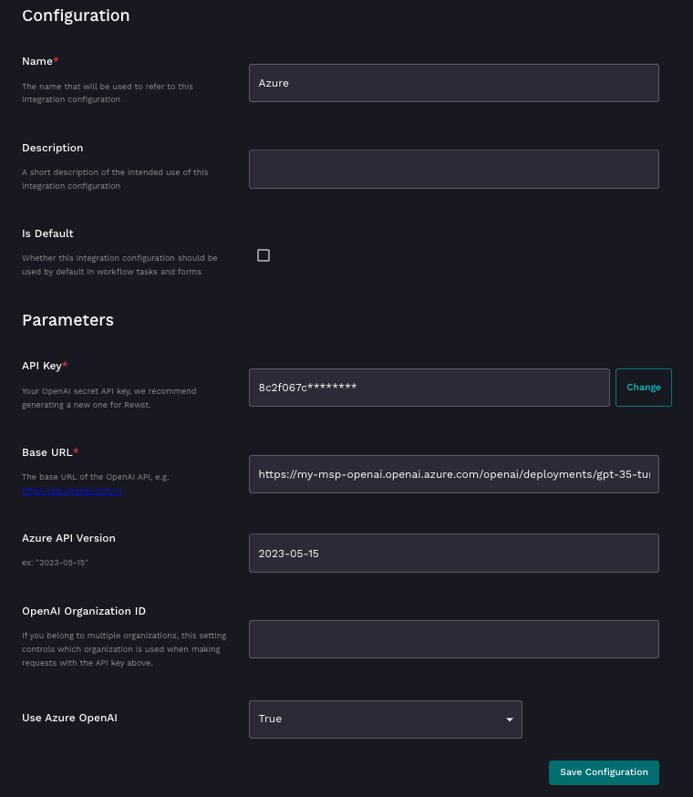<figcaption></figcaption></figure>


You must complete the Azure API Version field, otherwise, the integration will fail.



The validation popup may show a failure. This can be ignored. OpenAI validation URLs are currently used and will be updated in a future release.


### Configuring Workflow Triggers to Use Azure OpenAI

If this is your second instance of OpenAI (you configured the direct OpenAI integration before) then you may adjust your workflow triggers to choose which version of the integration you want to use in your workflows.

1. **Navigate** to _Integration Overrides_.
2. **Click** Add (the ➕ button).
3. **Choose** OpenAI for _Integration_.
4. **Choose** between your OpenAI integration instances to use in _Integration Configuration_.

<figure>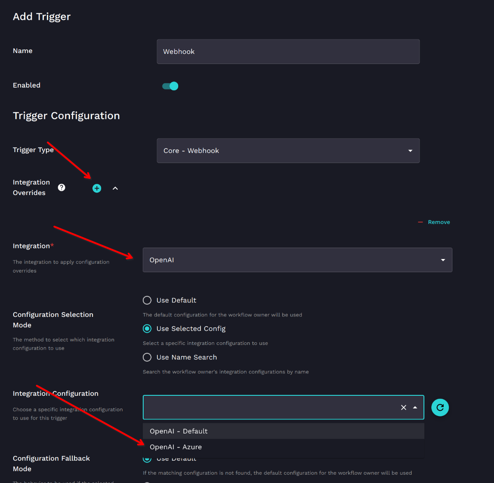<figcaption></figcaption></figure>
