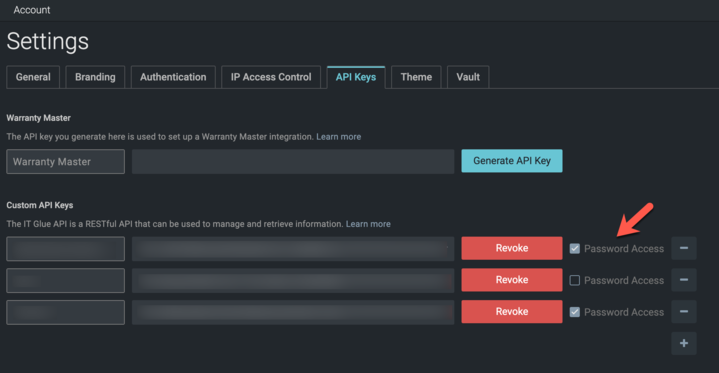

# Password Access

Rewst requires the "Password Access" checkbox to be enabled on the API Keys screen in ITGlue Account Settings.

<figure><figcaption></figcaption></figure>

For more information, check out the [IT Glue documentation](https://api.itglue.com/developer/).
