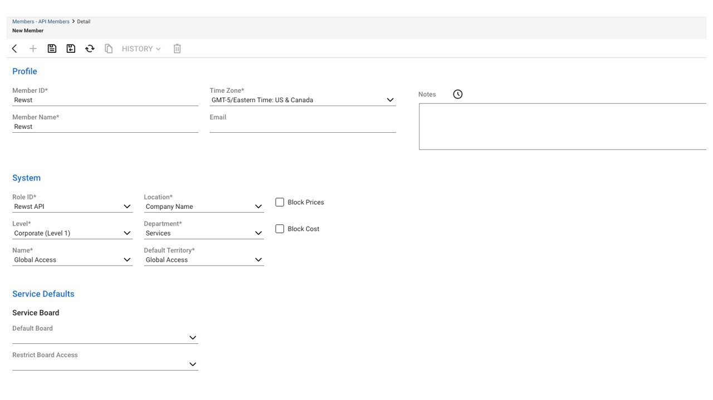
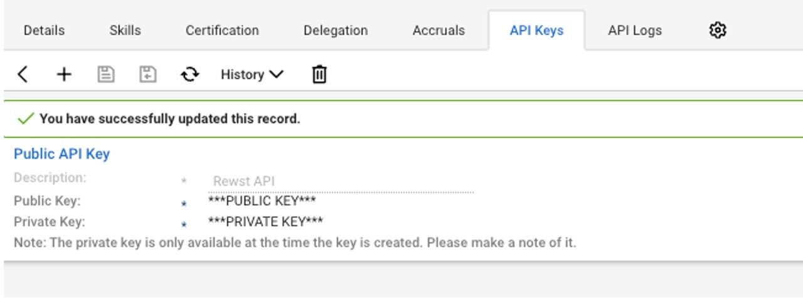
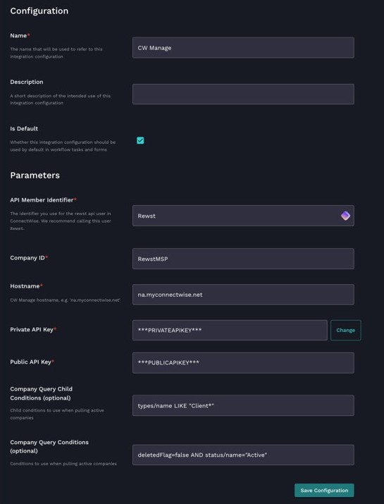

# Connectwise Integration Setup


**This Integration supports multiple instances**

[Check out the instructions to set up multiple instances here](../../general/multi-instance-integration/multi-instance-integration-setup.md).


## Requirements (pre-Rewst)

There are a few requirements for the ConnectWise Manage integration to work that need configuring by you as the MSP.

### API Account

In order to create a new ConnectWise Manage integration, you will need to create an API account. This can be done by [following the instructions](https://developer.connectwise.com/Products/Manage/Developer\_Guide/Authentication).

#### Creating an API Member

1. **Navigate to** System -> Members -> Api Members in ConnectWise Manage.
2. **Create** a new API member by clicking +.
3. **Create** a Member ID and Member Name.
   1. We recommend naming these "Rewst"
4. **Select** Rewst API as your Role ID.
5. **Select** Your Highest Level such as _Corporate (Level 1)._
6. **Select** a Location, Department, Name, and Default Territory as per your company guidelines.
7. **Click** the Save Icon at the Top.

<figure><figcaption>
Creating an API Member in ConnectWise Manage
</figcaption></figure>

8. **Click** on the Rewst API member.
9. **Click** API Keys -> "+".
10. **Add** a new API Key.
11. **Add** Rewst API as the Description.
12. **Click** the Save Icon.
13. **Save** the public and private key in a secure location.

<figure><figcaption>
Public and Private Key
</figcaption></figure>

Rewst has a number of tasks that can be performed using the ConnectWise Manage API, all of which require different permissions. You can review the [ConnectWise Manage Security Roles Matrix](https://developer.connectwise.com/@api/deki/files/422/Security\_Roles\_Matrix\_11132017.xlsx?revision=1) for more information.

#### Creating a Security Role

1. **Go to** System -> Security Roles -> Click the + in the top Left.
2. **Name** the Security Role "Rewst API" -> Click the save icon.
3. **Set** your permission as per [this document](least-privilege-access-requirements-for-connectwise-manage-integration.md).


You will need an active CW Developer account to access the above URL.


### Integration

Once you have created an API account, you will need to configure the integration within the Rewst platform.

Follow the below steps to configure a new integration:

1. **Log in** to the [Rewst platform](https://app.rewst.io/).
2. **Navigate to** Configuration -> Integrations.
3. **Click** or **search** for "ConnectWise Manage".
4. **Enter** the API Member ID.
5. **Add** the company ID used when logging into ConnectWise Manage.
6. **Add** the Hostname for ConnectWise Manage.
7. **Add** the Private & Public API Key.
   1. (Optional) Change the Company Query Conditions to filter what companies are returned by the API
8. **Click** Save Configuration.

<figure><figcaption>
Configuring ConnectWise Manage Integration in Rewst
</figcaption></figure>

### Configuration Form


**Other Integrations**

Note that this form asks for information about your RMM / M365 settings as well. Whilst this form can be completed again separately, it is recommended that you also set up the integration for Microsoft Graph and your RMM.


Once the integration has been configured within Rewst, we can use a Rewst form to configure your own custom settings and how Rewst should interact with ConnectWise Manage.


Obtain the Form URL With the way that forms work and integrate into workflows, the form URL is actually on the workflow itself. See [Terminology](../../../../cluck-university/getting-started/rewst-terminology.md) for more information.


1. **Go to** the Rewst Platform.
2. **Select** Workflows in the left menu.
   * You should see a workflow called **Set Org Variables**
3. **Click** on the workflow.
4. **Click** the _Settings cog_ icon.
   * On the new page, you will see the blue button labeled "View Form URL" below.
5. **Navigate** to the form, once you have the URL, and complete the settings below.

### General Options

| Option Name               | Description                                       |
| ------------------------- | ------------------------------------------------- |
| Default PSA               | The PSA used by you as an MSP                     |
| Default RMM               | The RMM used by you as an MSP                     |
| Primary Identity Provider | The primary location where your users are created |


Save

Ensure you save after setting these general default options, as it will pull data through from the configured integrations.


### **PSA Options**

| Option Name                                 | Description                                                                                                                                                                                                                                           |
| ------------------------------------------- | ----------------------------------------------------------------------------------------------------------------------------------------------------------------------------------------------------------------------------------------------------- |
| Default Ticket Location                     | This is the default board within CWM that the workflow will use if no other board is specified.                                                                                                                                                       |
| Default Ticket Status                       | This is the default status within CWM that the workflow will use if no other status is specified. This is usually _"In Progress"_                                                                                                                     |
| Ticket Status whilst waiting for input      | This is the default status within CWM that the workflow will use when further input is required, such as licensing approval. This is usually the _"Waiting Customer_"                                                                                 |
| No Time In Tickets                          | When a workflow runs, Rewst has the option of adding time to the ticket. This can either be done by the engineer who is the owner or if Rewst has a licensed user, can be Rewst itself. Note this is a limitation by CWM. Most MSPs use "_Zero time_" |
| VIP ContactType                             | If you have a specific Contact Type for VIP contacts, you can specify it here. This is not something we see most MSPs using.                                                                                                                          |
| New User Approval Email                     | If new user creations require approval, enter the e-mail it must go to such as "[_HR@company.com_](mailto:HR@company.com)"                                                                                                                            |
| Require Authorisation for Licence Purchases | If you want licenses to be approved before purchasing with the latest NCE changes, you can specify that requirement here.                                                                                                                             |
| New Ticket for Licence Purchases            | If licenses need to be approved, you can create a new ticket for that purchase                                                                                                                                                                        |
| Board ID for Licence Tickets                | If a new ticket is made for license purchases, which board should it be created in                                                                                                                                                                    |
| Active Customer Statuses                    | When syncing new clients, you can choose the client statuses that you want to sync such as _"Active"_                                                                                                                                                 |
| Active Customer Types                       | When syncing new clients, you can choose the client type that you want to sync such as _"Client"_                                                                                                                                                     |

### **M365 Options**

| Option Name              | Description                                                                                                                                               |
| ------------------------ | --------------------------------------------------------------------------------------------------------------------------------------------------------- |
| Mandatory Licence Groups | In the event you have a licensed group configured that all users must be a part of, you can specify it here. _e.g_ \*All users must have Business Premium |

### **Licensing / Distribution Options**

| Option Name                     | Description                                          |
| ------------------------------- | ---------------------------------------------------- |
| Microsoft Licencing Distributor | Specify the Disti that you use for license purchases |

### **Other Options**

| Option Name                   | Description                                                                                                                                       |
| ----------------------------- | ------------------------------------------------------------------------------------------------------------------------------------------------- |
| User Start-Date Behaviour     | Choose to either document the start date and do nothing, or pause the workflow until the start date and continue with user creation.\*            |
| Preferred Domain Controller   | If you have an on-prem DC, you can specify which you would prefer to be used for automation tasks                                                 |
| On-Prem Exchange Server       | In the event that you have an Exchange server on-prem, you can specify its name here for automation tasks to run against                          |
| Preferred Phone Number Format | In the event that you use a system like Exclaimer for signatures, you can ensure that the phone number is always formatted to a specific standard |


\*In the event you wish to create a user x number of days before the official start date, simply set the "Start Date" to the day you want the workflow to run rather than the actual user start date.


7. **Click** _"Yes"_ to apply new settings and press save.

You can at this stage click on Organization Variables on the left sidebar and you will see the settings you set in the form.
