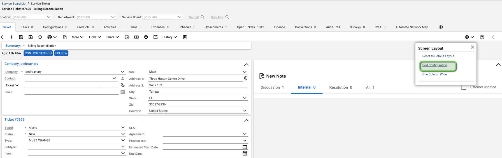
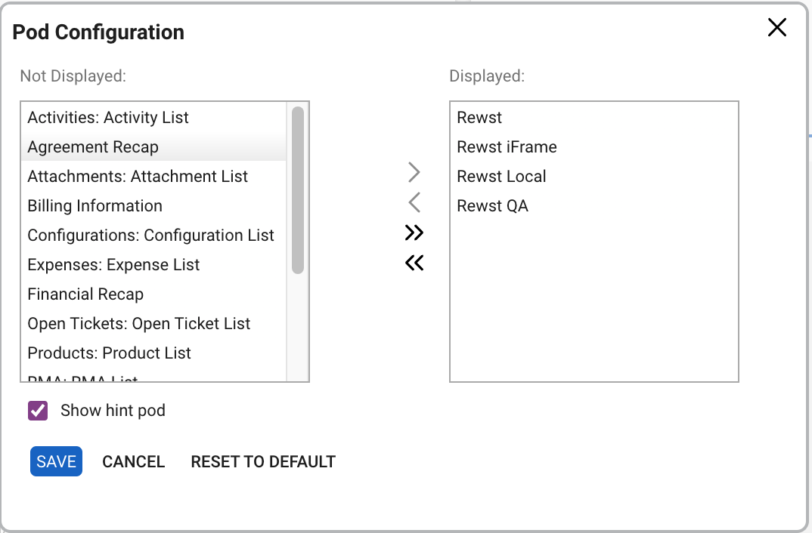

# Pod Configuration

ConnectWise Pods are a great method of getting information from Rewst into different areas within CWM, such as service desk tickets.


**Pod Authorization**

Note that pods do not allow the use of the fat client due to authorization pass-through issues. This means that you can use the web client to access pods.


### How to Configure ConnectWise Pods

In order to configure the connection between your pods and Rewst, follow the below steps:

1. **Login** to ConnectWise Manage as a user that has access to the Setup Tables (likely an admin account).
2. **Click** the System icon on the bottom right of the CWM UI.
3. **Click** On the _Setup Tables_ menu that appears.
4. **Enter** `\*api\` In the table filter and your returned result should be "Manage Hosted API".
5. **Click** Add and use the below settings:
   1. **Description** - Enter _Rewst_
   2. **Screen** - For our example, we use "Service Tickets"
   3. **Origin** - [https://app.rewst.io](https://app.rewst.io)
   4. **URL** - [https://app.rewst.io/organizations/\<org\_id>/integrations/embed/ticket/\[cw\_id\]](https://app.rewst.io/organizations/%3Corg\_id%3E/integrations/embed/ticket/\[cw\_id)
6. **Select** Pod.

### Adding Pods to Tickets

1. **Click** the Settings icon in the top right.
2. **Select** _Pod Configuration_.

<figure><figcaption>
Selecting the Settings Icon
</figcaption></figure>

3. **Move** the Rewst pods to the 'Displayed' table.

<figure><figcaption>
Adding Rewst Configured Pods
</figcaption></figure>


**Firefox Dynamic State Partitioning**

An issue arises with Firefox's Dynamic State Partitioning where the default `network.cookie.cookieBehavior` value of 5 rejects (known) trackers and partitions third-party storage, hindering the authentication process and causing a logged GraphQL error. This issue also occurs with embedded forms.

Firefox users must set `network.cookie.cookieBehavior` to 4 for successful pod authentication.

Consult the official Firefox documentation for more information: [https://developer.mozilla.org/en-US/docs/Web/Privacy/State\_Partitioning#disable\_dynamic\_state\_partitioning](https://developer.mozilla.org/en-US/docs/Web/Privacy/State\_Partitioning#disable\_dynamic\_state\_partitioning).\\



**URL**

Note that you will need to add your own `org_id` to the URL below. This can be obtained by going to Rewst and looking at the URL. Note that `[cw_id]` should be left as is.


You will have a workflow called `[Rewst Master v3] Pods: Technician Toolbox` within your organization.
