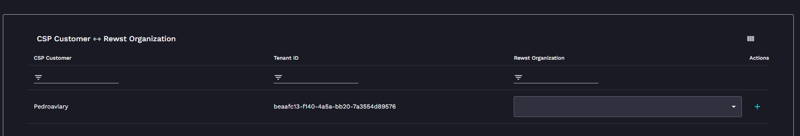
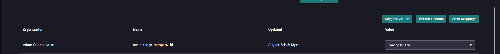
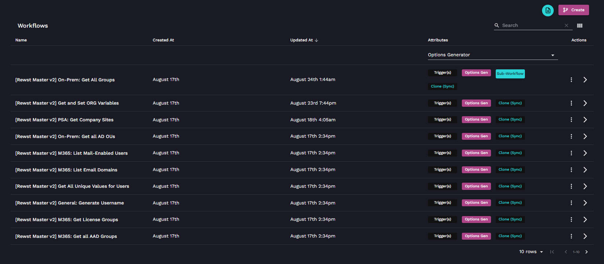
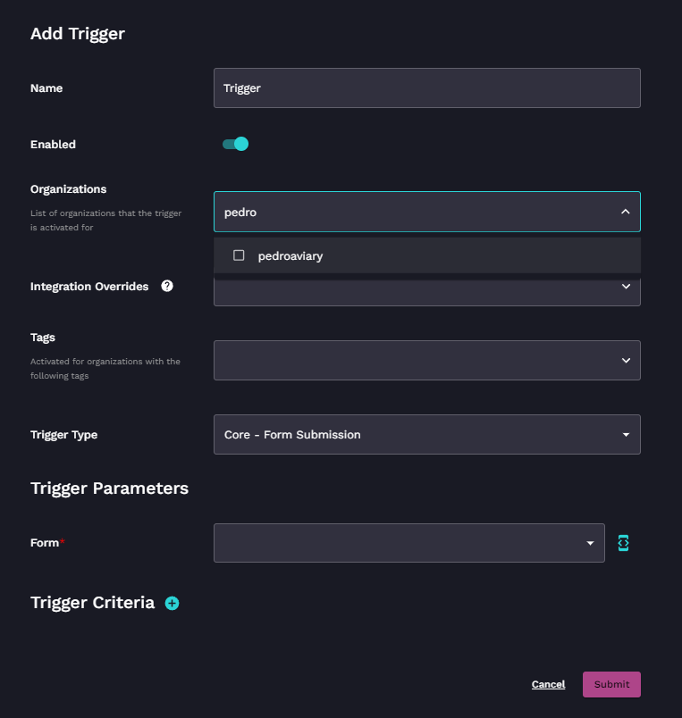

# Adding a new Client to Rewst

## Step One

The first part of adding a client is to actually create them within Rewst itself. The easiest way to do this is to add them via the Microsoft CSP Integration. Navigate on the left navigation menu to _Configuration → Integrations → Microsoft CSP._

<figure><figcaption></figcaption></figure>

You will see a list of your clients on the left and can filter using the options across the top. On the right, you will see the empty dropdown as per the image above. You will be asked to enter a name. Note this is the name of the organization within Rewst, we recommend you match this with the company in the PSA to make it identifiable quicker. Press the green + icon to the right of the dropdown

Once you click Submit, the dropdown will auto-fill with the client you created.

## Step Two

The second step is matching the organization you created to the various companies in your other platforms, such as your PSA and RMM.

Navigate on the left navigation menu to _Configuration → Integrations_ and click through each installed integration (shown at the top).

<figure><figcaption></figcaption></figure>

On the right-hand side, you will see an empty dropdown for the org you made. You can either:

1. Click "Suggest Matches" which will attempt to fuzzy match the org name. Make any necessary changes and then click Save Mappings.
2. Manually work through each empty dropdown and select the relevant company in the integration. Click Save Mappings.

Once you have done this for each integration, you are arguably "done" and can start building workflows for those clients. There is however some additional work to do if you are adding clients to existing workflows or forms, such as the New User Onboarding workflow.

## Step Three (Optional)

This is an optional step as it is only relevant if you have existing workflows, forms, or triggers that are already configured.

This is the bit where most people slip up because it's usually the ROC team that does this initially during the onboarding phase.

When working with forms that pull data from various integrations (such as departments within the New User workflow), you have to add the new client onto the trigger on the workflow, for it to work successfully.

Within your workflow list, by going to _Automations → Workflows_ you can filter all workflows by "[Option Generators](../workflows/workflow-generated-options.md)". You'll have roughly 10 of these showup, similar to the below image.

<figure><figcaption></figcaption></figure>

The easiest way to then work through these is by holding Ctrl + Left and Clicking the names of each, which will open a new tab for each.

On each of these workflows, you can then click the cog on the top for the trigger and click the dropdown for "Organization" - tick the new org you have created and press Submit.


Go [here to learn more about Triggers](../triggers/)


<figure><figcaption></figcaption></figure>

## Step Four (Optional)

This is an optional step as it is only relevant if you have existing workflows, forms, or triggers that are already configured. If you have had to do Step 3, then the chances are you will also need to do this step too.

You will likely be used to going to a workflow and clicking the "View Form URLs" button on the trigger. You will notice that your new org does not have a URL here yet.

Note that if you aren't sure and have finished onboarding, it's likely these two workflows:

1. \[Rewst Master v2] Client: New Employee
2. \[Rewst Master v2] Get and Set ORG Variables

This is similar to the above step where on that trigger, you must add that org by ticking them in the dropdown and pressing submit.

When you go back into that trigger, you will see the URLs for that new org.

## Step Five (Recommended)

This is a recommended step for any new client and includes setting up ORG Variables for the client. You should be familiar with this process from your ROC member discussing it with you.

Navigate to _Automations → Workflows → \[Rewst Master v2] Get and Set ORG Variables_

Click the Trigger _→_ View Form URLs and click the one for the new client you have filled in.


Remember that ORG Variables inherit from the top level, so the only things you have to fill in here and things that are DIFFERENT from your MSP. See recommended fields below


Our recommended fields to fill in are:

1. Primary Identity Provider
2. Username Format
3. Preferred Domain Controller (only a required field if using Ninja right now)
4. Preferred ADConnect Server (required if using ADConnect)
