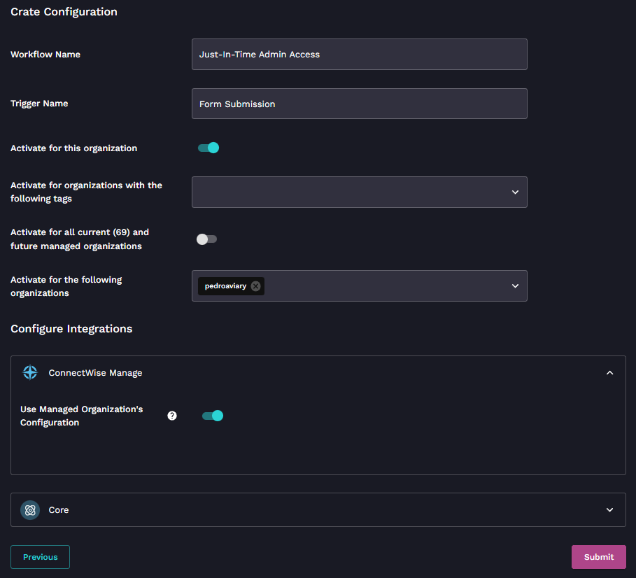

# What is a Crate?

## **Introduction**

A crate bundles workflows, forms, triggers, templates, scripts, and other essential components required for a specific function. These are usually built and curated by our ROC team or from our community to facilitate easy deployment.


Check out our [the-crate-marketplace.md](../../cluck-university/electives/the-crate-marketplace.md "mention") video to learn more about the Crate Marketplace!


## **Unpacking a Crate**

1. **Access the Crate Marketplace:**
   * Visit [Rewst Application](https://app.rewst.io/)
   * Navigate to `Crates > Crate Marketplace`.
2. **Select Your Crate:**
   * Browse through the marketplace to find your desired crate or use its direct link.
   * Click on the chosen crate to view its details and requirements.
3. **Review and Adjust Settings:**
   * (Optional) Rename the Workflow as per your preference.
   * Set or adjust any thresholds if available.
   * Choose relevant integrations or options.
4. **Manage Triggers:**
   * You might encounter a screen prompting you to enable or disable specific triggers.&#x20;
   * Ensure you're only enabling the triggers that are relevant to you, and adding any necessary customizations required by your business logic here to avoid overwriting on updates.
5. **Finalize:**
   * Click on the `Unpack` button.
   * Once done, you can test the crate (e.g., create a ticket in your PSA and observe the results).

Remember, unpacking essentially prepares the crate for your organization. After unpacking, always check its performance to ensure it's functioning as expected.

## Example Crate Configuration

You can see what integrations that are required for each Crate and choose to enable for this organization or all managed organizations.

<figure><figcaption></figcaption></figure>


If you enable a workflow but the client doesn't have the required integration, you will receive a warning and a link to set that up as required.

