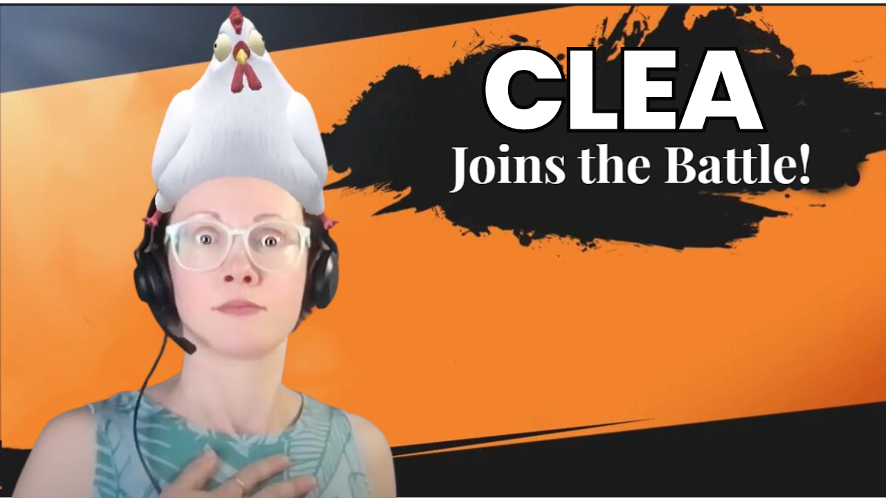

# March 15th, 2024

Explore what new changes the Training team has made in the last week.

<strong>General News and Reminders</strong>

* **Game Tip for the Week:**  If you're not already an RPG fan, just become one. If you do, this will be the best gaming year of all time for you and we're only in March. Also, if you have a full-time job and know how long a top 10 video takes to make, don't decide to make a video ranking all the Final Fantasy games... Just don't do it. ALSO! If you missed Sea of Stars last year, they are adding LOCAL CO-OP! So buy it and find somebody to play with!
* **SHOUT OUT** to Hayden, Jordan, Eugene, Chris, Brett, Dan, and Tahla for successfully taking our [foundations-certification.md](../../cluck-university/rewst-foundations/foundations-certification.md "mention") Exam, and collecting your prestigious **Certified Rewster** badge in Discord.&#x20;
* We have unified the docs format for our 100 series, making it more searchable, and beefed up our resources section for each page.
* Join us in our [Cluck-U Discord channel](https://discord.com/channels/936789089703845988/1121465945295167588) if you have any questions, comments, or concerns!

<strong>Cluck U and Documentation Updates</strong>

**What's New at Cluck University?**

* We'd love to get your feedback on our Training and Documentation! [Please fill out this form to let us know how we can improve](https://app.sli.do/event/m8C3AjPUnuDgpkVDmPsQL3)!
* As a reminder, you can make training and documentation requests at [https://rewst.canny.io/](https://rewst.canny.io/)
* Clea has joined the battle to educate! She will be delivering the Rewst 101 Training next Monday, March, 18th!

* All Cluck U Course pages have been updated for clarity
* Links to additional resources have been added to each of the pages

**New & Updated Pages:**

* [march-8th-2024-live-from-right-of-boom-its-the-roc-open-mic.md](../roc-open-mics/march-8th-2024-live-from-right-of-boom-its-the-roc-open-mic.md "mention") page added
* [graph-error-when-using-sendmail-as-impersonated-user.md](../../documentation/integrations/cloud/microsoft-cloud-integration-bundle/common-issues-with-microsoft-bundle/graph-error-when-using-sendmail-as-impersonated-user.md "mention") page added
* [rewst-user-setup-and-gdap-relationship-guidance.md](../../documentation/integrations/cloud/microsoft-cloud-integration-bundle/microsoft-csp/rewst-user-setup-and-gdap-relationship-guidance.md "mention") steps updated for accuracy
* [data-input-and-output.md](../../documentation/workflows/data-input-and-output.md "mention") page updated for clarity and searchability&#x20;
* [twilio-integration-setup.md](../../documentation/integrations/voip-and-sms/twilio/twilio-integration-setup.md "mention") page updated to include full steps
* [jinja-essentials.md](../../documentation/jinja/jinja-essentials.md "mention") page added with expanded examples from 103
* [microsoft-graph-vs-exchange-online.md](../../documentation/integrations/general/microsoft-graph-vs-exchange-online.md "mention") page added with more detail from 104 and 105

